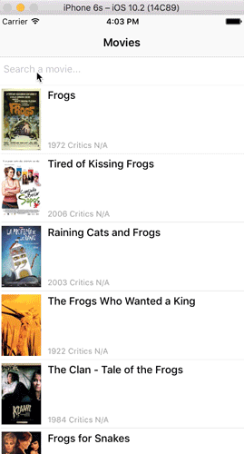

# Example purescript-reactnative Movie app

This is a [`purescript-reactnative`](https://github.com/doolse/purescript-reactnative) & [`purescript-react-simpelaction`](https://github.com/doolse/purescript-react-simpleaction) based port of the [Movies](https://github.com/facebook/react-native/tree/master/Examples/Movies) example react native app, with a couple of differences at the moment:

- It points to https://www.omdbapi.com/ instead of rotten tomatoes
- Scrolling beyond the first 10 results is not supported yet
- Queries aren't cached

# Running it on Android

Start your emulator or phone

```
npm install
npm run build:android
react-native run-android
```

You may also have to start the react-native dev server with (in the repo dir):

```
react-native start
```

also you may need to proxy the dev server with:

```
adb reverse tcp:8081 tcp:8081
```

# Running on iOS



```bash
npm install
npm start
npm run build:ios
```

Note: If you have some issues to fetch data with Simulator set `Allow Arbitrary Loads` to `YES` in `info.plist` (via http://stackoverflow.com/a/38219454/2032698)
